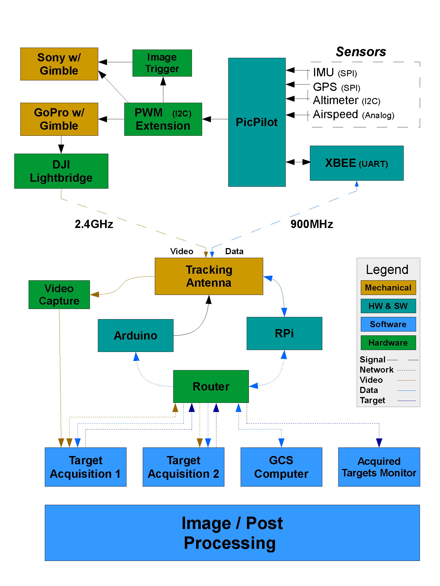

# Introduction

The groundstation is a desktop application based on [NW.js](nwjs.iohttp://nwjs.io/). This section will explain what NW.js and [Node.js](https://nodejs.org/en/) is, as well as setting up your development environment for building the application.

## Communication Path

The groundstation talks directly to the [data-relay-station](https://github.com/UWARG/data-relay-station). The data-relay-station is a simple python server that acts as the middleman between the PicPilot running on the plane and the groundstation running at the base. The PicPilot sends data using it's xbee module, which the tracking antenna receives relaying it to the data relay station, which sends it to the groundstation. The groundstation can then, based on the data received, send commands back through the same path. As seen from this picture, the groundstation acts as one of the 'clients' to the data relay station (the raspberry pi).

## What is Javascript and Node.js

As you may already know, javascript is a programming language. It's syntax is very similar to other C-based languages such as C++, Java, and so forth. Javascript was initially intented to only run on the browser, and one of it's biggest limitations is that it doesn't have file access to your computer (for security purposes). This limitation prevented developers from using it other than for web application purposes. 

*Enter [Node.js](https://nodejs.org/en/)*

Node.js is a cross platform javascript runtime built on Chrome's V8 JavaScript engine. A lot of fancy words there. What this basically means is that Node provides a way for you to run javascript code natively on your computer without the need for a browser. It's essentially an interpreter. In the same way you can run python scripts with `python script.py` you can run javascript scripts with `node script.js`. It's important to note that node.js isn't a language itself. You write javascript code and then run it with node.js to execute it. 

## What is NW.js

Ok, so where does [NW.js](http://nwjs.io/) fit in all this? Why do we need it if we can already write native applications with node.js and javascript. You can think of NW.js as a GUI framework. Usually making a GUI, especially one that's cross-platform (being able to run on Linux, Mac, and Windows) you have to work with very low level graphic libraries and other weird shenanigans that are specific to each OS you're working it. That's what NW.js provides. It abstracts the creation of GUI's and allows you to create cross-platform desktop applications using a single interface. It's the equivalent of the Swing framework for Java or Qt for C++.

NW.js itself runs on top of node. How NW.js works is pretty simple. Basically it opens up a customized version of chrome and your app runs through there. So what you're essentially building is a web page, and using javascript to add functionality to the web page.

## Installation

1. The first step is cloning the repository. Open up the terminal and run: 
`git clone https://github.com/UWARG/WARG-Ground-Station`

2. Then you need to install Node.js. You can download and install it [here](https://nodejs.org/en/). Download Node version 5 and above preferably. After you've installed node you should have the `node` command available for you to use in your terminal. Run `node help` to verify that you've successfuly installed node and make sure you're running the right version.

3. Now that you've installed node, navigate to the groundstation project directory (the folder that was created when you did the git clone). Then run `npm install` to install all of the apps dependencies. If you get weird errors, try running your terminal in administrative mode (or sudo for linux users).

4. Now you're ready to start the app up. Run `npm start` to start the application. You should see a window appear of the groundsation.

5. Now you need to download the offline satelite files that the application uses for it's map. [Download them here.](https://drive.google.com/file/d/0BwjduHozuvOiaUFzV2dZdncyZnc/view). Extract the zip into the `assets` folder of the project directory (so you should have a folder called `sat_tiles` in the assets folder). 

Congratulations! You should now have the groundstation installed on your computer ready for you to develop on! 

